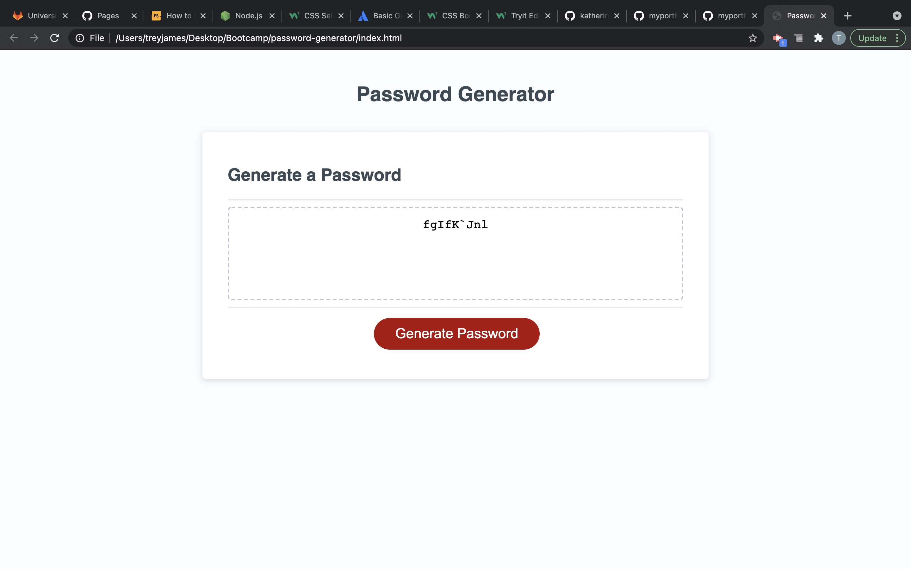

# Password-Generator
HW3 - password Gene

## Table of Contents
-[General Info](#General-Info)
-[Version History](#version-history)
-[Screenshots](#screenshots)
-[Technologies Used](#technologies-used)
-[Location](#location)
-[Contact](#contact)

## General Info
As a developer I was asked to modify existing code to create a random password generator for employees based on criteria they selected. The passwords can include lower case or upper case letters, numbers or special characters. 

## Version History
Version 2
Date Modified: 5/15/2021
Modified by: Trey James

Updated ReadMe file to be more detailed.

## Screenshots

    
## Technologies Used
Visual Stude Code
HTML
CSS
JavaScript

## Location
View our website here: https://tdjames20.github.io/password-generator/

## Contact 
Trey James - [Github] (https://github.com/tdjames20) Email: [Trey](mailto:tdjames5@yahoo.com)
